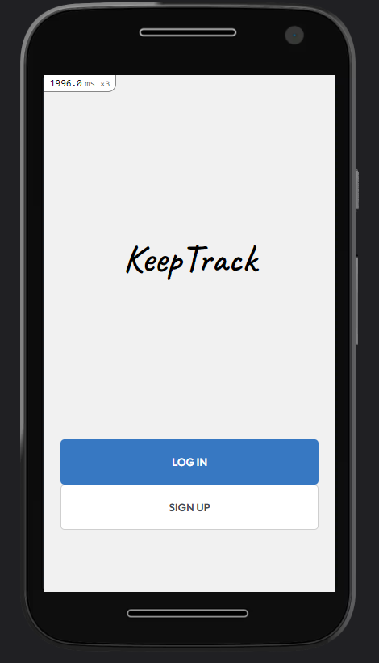

# Rails Capstone - Budget App

> This app goal is to let it's user keep track of its transactions.
# [Video Presentation Link](https://www.loom.com/share/0885f4ac1a73466e9b68a692e2fdd351)

## Built With

- Ruby
- Ruby on Rails
- VScode
- Git & GitHub
- PostgreSQL
- Rspec
- Capybara

## Live Demo

[Live Demo Link](https://safe-reef-20208.herokuapp.com)

## Getting Started

To get a local copy up and running follow these simple example steps.

### Prerequisites

- Ruby
- Rails
- Git and GitHub
- Command Line
- Browser
### Setup

- In your commandline choose where you want to clone this repository into.
- Run the following command: `git clone https://github.com/tiagorahal/budget-app.git`
### Install

- Setup a .env file with your database variables if needed. Check /config/database.yml for more info.
- Run these commands in order:
- `bundle install`
- `rails db:create`
- `rails db:migrate`

### Usage

- Simply run `rails server`
### Run tests

- Run one of the following commands:
- `rails test`
- `bundle exec rspec`
- `rspec` 
## Authors

👤  **Tiago Rahal Aires**

- GitHub: [@tiagorahal](https://github.com/tiagorahal)
- Twitter: [@RahalAires](https://twitter.com/RahalAires)
- LinkedIn: [Tiago Rahal Aires](https://linkedin.com/tiagorahal)

## 🤝 Contributing

Contributions, issues, and feature requests are welcome!

Feel free to check the [issues page](../../issues/).

## Show your support

Give a ⭐️ if you like this project!

## Acknowledgments

- [Original designer](https://www.behance.net/gregoirevella)

## 📝 License

This project is [MIT](./MIT.md) licensed.
